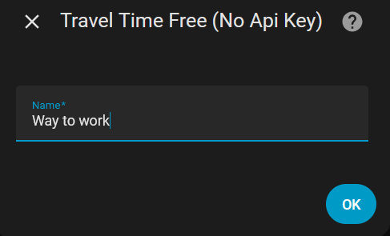

# **Google Maps Travel Time**

## **✨ Free & Open Source**

This Add-on and Integration is completely **free to use**, requires **no registration**, and uses **no external subscriptions**. It is an open-source community project.  
This custom Home Assistant integration and companion Add-on retrieves the current travel time between two defined locations from Google Maps upon request, enabling powerful automations based on real-time traffic conditions.

## **🚀 Features**

* **On-Demand:** Calculation is triggered by a button entity to save resources (no continuous polling).  
* **Real-Time Data:** Uses a dedicated Playwright/Firefox Add-on backend for accurate Google Maps data.  
* **Modular Architecture:** Runs necessary scraping libraries (Playwright/Firefox) in a dedicated Add-on container, keeping the core Home Assistant system stable.  
* **Status Tracking:** Provides a last\_updated sensor to monitor the timestamp of the last request status.

## **💾 Installation**

The **HATravelTime** solution requires installing two components via the Custom Repository feature: **The Integration** (HACS) and **The Add-on** (Backend).

### **Repository URL (for both)**

| Repository URL (for custom repositories) |
| :---- |
| https://github.com/Renegaded66/HATravelTime.git |

### **A. Integration Installation (via HACS)**

1. Open **HACS**. Go to the **three dots menu** (⋮) → **"Custom repositories"**.  
2. Paste the URL above and select **"Integration"**. Click **"Add"**.  
3. Find **Google Maps Travel Time**, click **"Download"**.  
4. **Restart Home Assistant** to finalize.


<summary>With HACS</summary>

[](https://hacs.xyz/)

1. Add this repo as a [custom repository](https://hacs.xyz/docs/faq/custom_repositories/).
   It should then appear as a new integration. Click on it. If necessary, search for "Travel Time".

   ```text
   https://github.com/Renegaded66/HATravelTime
   ```

### **B. Add-on Installation (Required Backend)**

The Add-on is **mandatory** because external libraries cannot run inside a standard integration.

1. Go to the **Add-on Store**. Go to the **three dots menu** (⋮) → **"Repositories"**.  
2. Paste the URL above. Click **"Add"**.  
3. Find the new **Travel Time Add-on**. Click **"Install"**. (This may take a moment due to browser library downloads.)  
4. **No configuration is needed**. Simply click **"Start"**.  
5. Check the Logs for a message like **"Starting Travel Time"** to confirm the service is running.

## **🛠️ Integration Configuration & Usage**

Once both components are running, you can configure multiple trips.

### **Configuration**

Define your desired trips, specifying a **Name**, **Start Point (Source)**, and **Destination Point (Target)** for each.

### **Usage: Step-by-Step Guide**

The travel time calculation is always triggered by the Button entity.

#### **1\. Configure Your Trip**

First, set up your desired route in the Integration settings.

* **Step 1: Click 'Add Entry'**  
* Step 2: Name & Locations  
  Provide a Name for your trip and select the Start Point (Source) and Destination Point (Target).  
  
* Step 3: Entities Created  
  After saving, the Button, Sensor, and Last Updated entities for your trip are now available in Home Assistant.
  

#### **2\. Triggering the Calculation**

To get the real-time travel time, you must interact with the Button entity.

* Step 4: Access the Button Entity  
  Navigate to the Button entity (e.g., button.commute\_to\_work\_calculate) on your dashboard or in Developer Tools.  
* Step 5: Calculate (Press)  
  Click "PRESS" (or "Drücken" in German UI) on the Button entity to send the scraping request to the Add-on.  
  \[Image showing a clicked/activated button entity\]  
* Step 6: Verify Update  
  Wait a few moments (usually 5-15 seconds) until the Last Updated Entity (e.g., sensor.commute\_to\_work\_last\_updated) is updated to the current time, confirming the request has completed successfully or failed.  
  \[Image showing the sensor.commute\_to\_work\_last\_updated entity updated with a recent timestamp\]  
* Step 7: View Travel Time  
  The real-time travel time is now available in the Sensor Entity (e.g., sensor.commute\_to\_work\_travel\_time).

### **Automation and Script Usage**

This feature is best used within Home Assistant Automations and Scripts by calling the button.press service on your trip's button entity.

* Automation Example: Monday Commute Notification  
  This automation notifies you of the travel time every Monday morning at 7:00 AM.